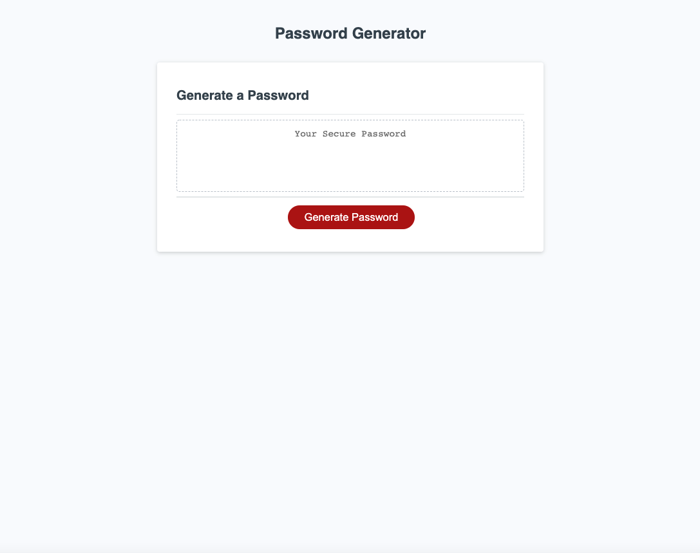
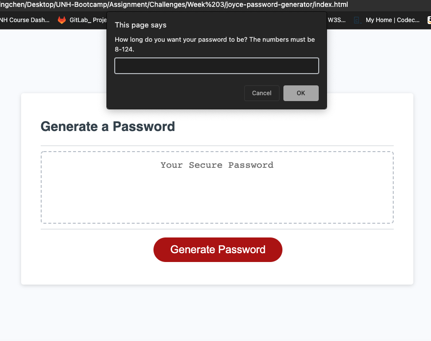
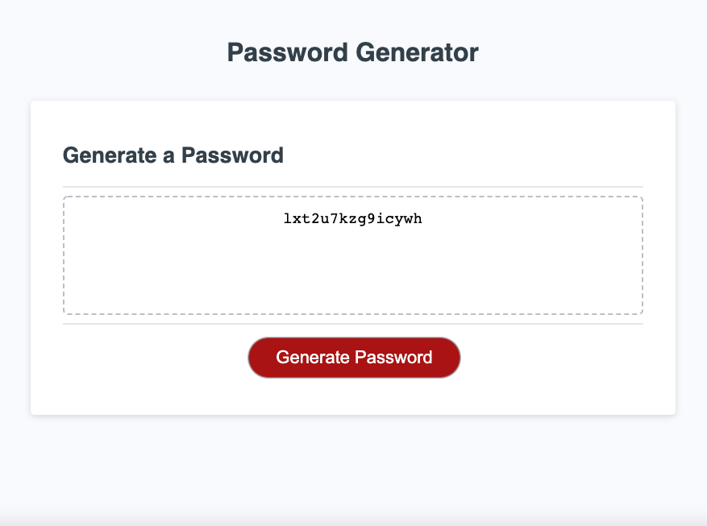

# Module 3 Challenge: Create a password generator in JavaScript

## Purpose:

### A codebase of password generator that allows an employees to generate a random secure password to access sensitive data to privide greater security

---
## Table of Content:

* [JavaScript](#javascript)  <a name="javascript"/>

* [Deployed Image](#deployed-image)<a name="deployed image"/>
  
* [Github Links](#github-links)<a name="github links"/>

---

## JavaScript:

* Create variables

* Use console.log to check the codes

* function generatePassword()

* If statement 

* Prompt to request user's input

* Confirm to request user's choice by (yes or cancel)

* For loop

* Empty array for user's preferred input

* generateBtn.addEventListener

---

## Deployed Image:

The following image shows the password generator application's appearance and functionality:

---

---

---

## Github Links:

* Github URL:      
  https://github.com/Joyce750526/joyce-password-generator

* Github Deployed Page:
  https://joyce750526.github.io/joyce-password-generator/

---

## Chao-Ying (Joyce) Chen

<!-- The password can include special characters. If you’re unfamiliar with these, see this [list of password special characters](https://owasp.org/www-community/password-special-characters) from the OWASP Foundation. -->
