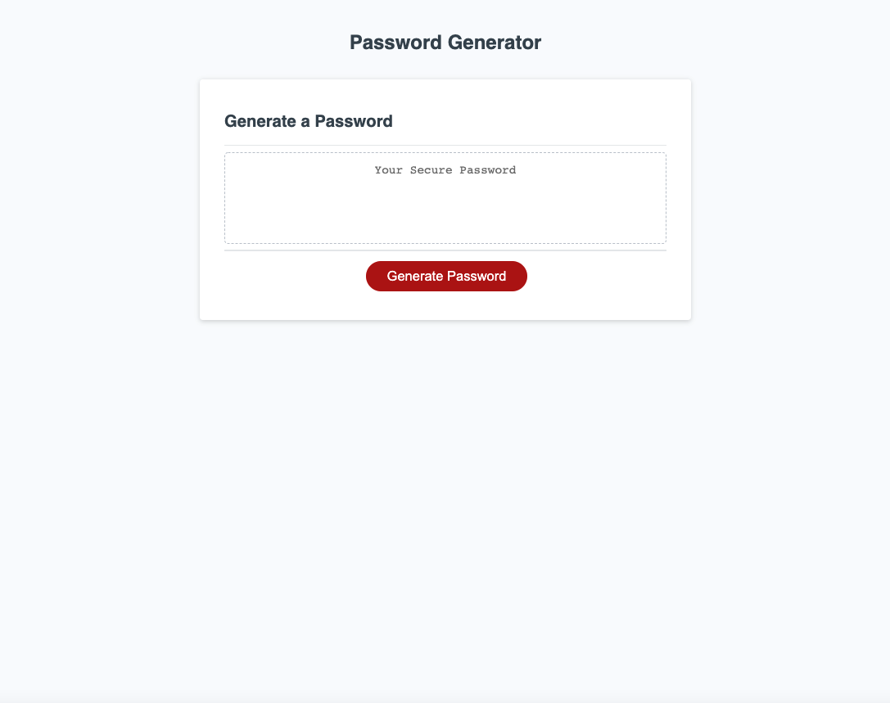

# Module 3 Challenge: Create a password generator in JavaScript

## Purpose:
### A codebase of password generator that allows an employees to generate a random secure password to access sensitive data to privide greater security

---

## JavaScript:

* use variables
* console.log
* function generatePassword()
* prompt 
* loop
* empty array for user's preferred input
* var generateBtn 
* enerateBtn.addEventListener

---
## Deployed Image:

The following image shows the password generator application's appearance and functionality:

---
## Required to submit the following URL for review:

* Github URL: https://github.com/Joyce750526/joyce-password-generator
* Github Deployed Page: https://joyce750526.github.io/joyce-password-generator/

- - -
Chao-Ying (Joyce) Chen
---

The password can include special characters. If you’re unfamiliar with these, see this [list of password special characters](https://owasp.org/www-community/password-special-characters) from the OWASP Foundation.
